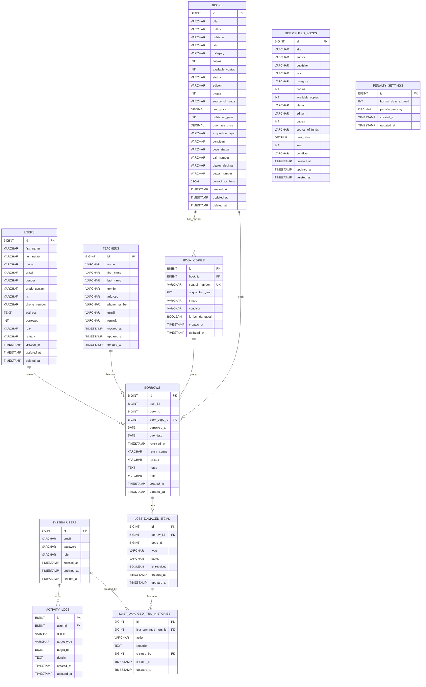

**ERD (MySQL)**

**Relationship Notes**
- `book_copies.book_id` references `books.id` via FK. Each book can have multiple copies.
- `book_copies.control_number` is unique within the system and tracks individual book copies.
- `borrows.book_copy_id` links borrowing transactions to specific book copies for better tracking.
- `borrows.user_id` is used for both students (`users`) and teachers (`teachers`) based on role logic.
- `lost_damaged_items.borrow_id` references `borrows.id` and tracks when items are marked lost or damaged.
- `lost_damaged_item_histories` maintains a complete audit trail of all status transitions without overwriting prior records.
- `activity_logs.user_id` references `system_users.id` via FK.

Sources: `app/Models/*`, `database/migrations/*`, `app/Http/Controllers/BorrowController.php`, `app/Http/Controllers/BookController.php`, `app/Http/Controllers/DashboardController.php`, `app/Models/BookCopy.php`, `app/Models/LostDamagedItem.php`.
