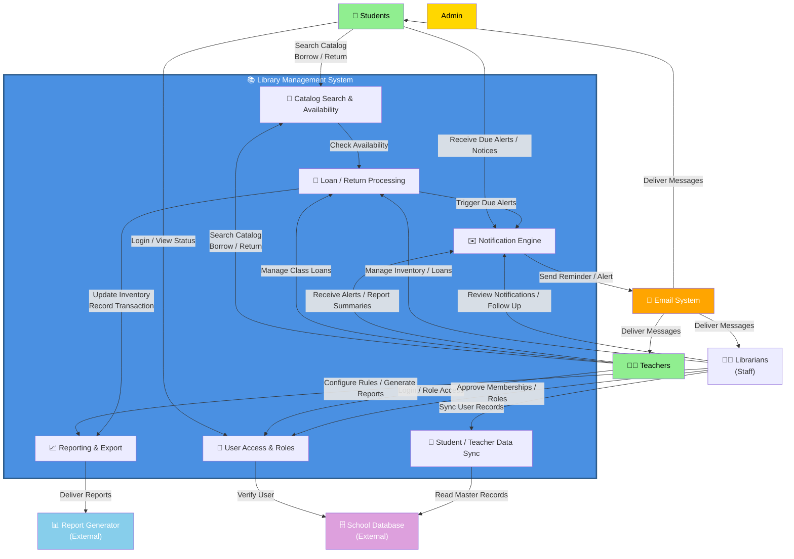

# Context Level Diagram

## System Context

The Library Management System operates within the school environment, interacting with users and external systems while coordinating internal processes for cataloging, loans, notifications, and reporting:

## System Boundaries

| Component | Type | Description |
|-----------|------|-------------|
| **Students** | External Actor | Borrow books, search catalog, view account and due status |
| **Teachers** | External Actor | Borrow books for classes, manage bulk distributions, and view records |
| **Librarians/Staff** | External Actor | Manage inventory, loans, memberships, notifications, and reporting |
| **Email System** | External System | Delivers reminders, alerts, and notifications to users |
| **School Database** | External System | Provides authoritative student and teacher master data for authentication and validation |
| **Report Generator** | External System | Receives exported analytics and reports for external consumption |

## Key System Processes

1. **Catalog Search**: Users search the library catalog and confirm availability before start of a loan.
2. **Loan / Return Processing**: The system records borrow requests, validates user eligibility, updates inventory, and handles returns.
3. **User Access & Roles**: Authentication and role-based access control determine whether a user is a student, teacher, or administrator.
4. **Notification Engine**: The system triggers due-date alerts, overdue reminders, and inventory notifications through email.
5. **External Data Sync**: The library syncs with the school database to validate user identities and refresh student/teacher records.
6. **Reporting & Export**: Transaction summaries, inventory reports, and analytics are exported to the reporting service.
