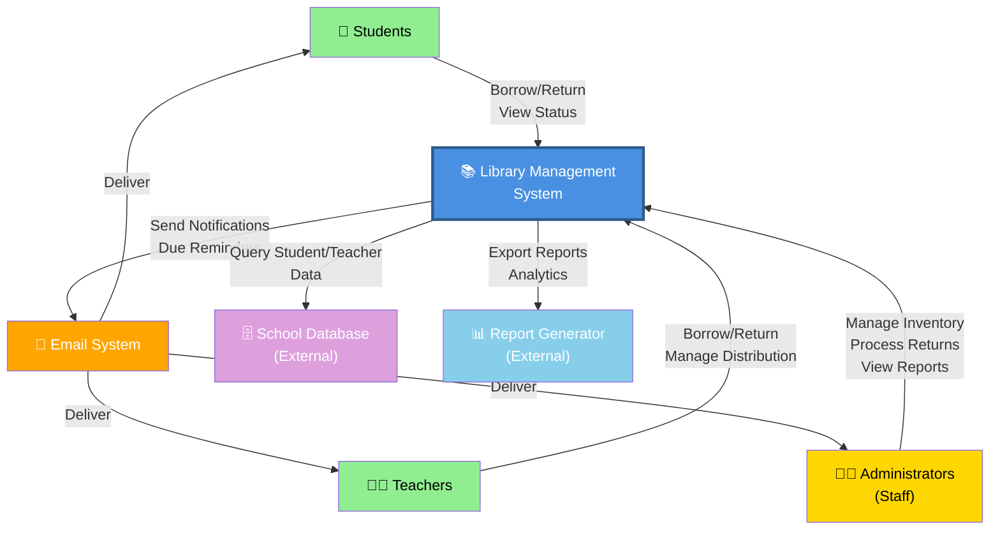

# Context Level Diagram

## System Context

The Library Management System operates within the school environment, interacting with users and external systems:

## System Boundaries

| Component | Type | Description |
|-----------|------|-------------|
| **Students** | External Actor | Borrow books, check due dates, view personal records |
| **Teachers** | External Actor | Manage class distributions, borrow books |
| **Administrators/Staff** | External Actor | Manage entire system: inventory, users, rentals, reports |
| **Email System** | External System | Notifications and due date reminders |
| **School Database** | External System | Student and teacher master data (read-only) |
| **Report Generator** | External System | Export reports and analytics |

## Key Interactions

1. **Student Portal**: Browse catalog, check availability, view borrow history
2. **Teacher Distribution**: Bulk book distribution, management interface
3. **Admin Console**: Full system management, reporting, configuration
4. **Notification Engine**: Automated due date reminders via email
5. **Data Integration**: Sync with school's master student/teacher database
