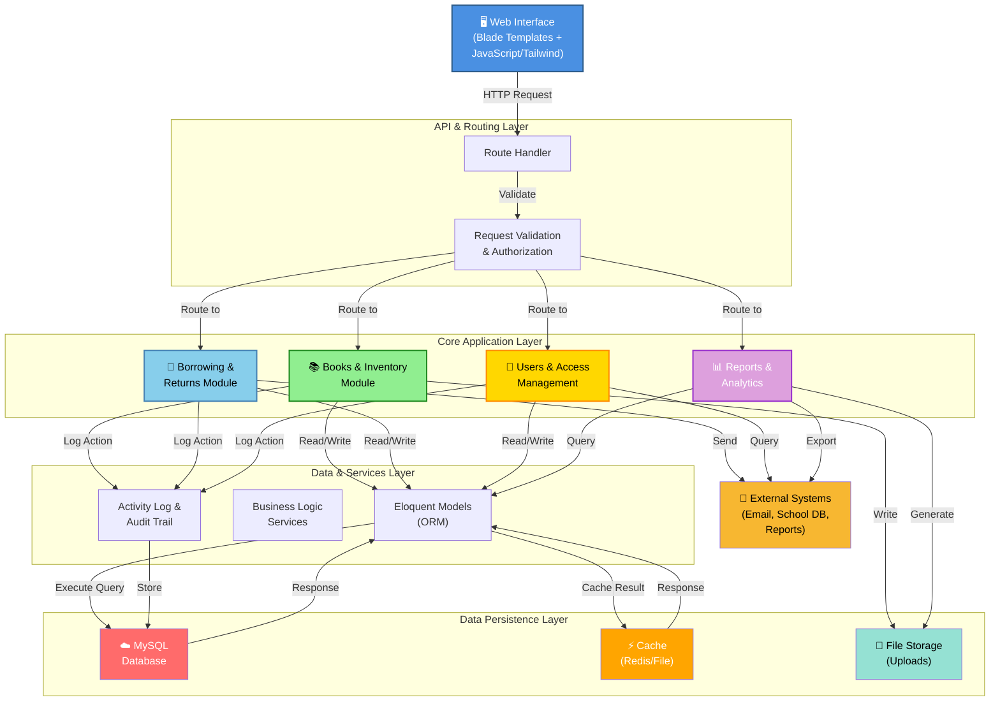

# Top Level System Diagram

## System Architecture Overview

The Library Management System is organized into integrated modules that work together to manage the complete book lifecycle and user interactions:



## Module Responsibilities

| Module | Primary Responsibilities | Key Features |
|--------|-------------------------|--------------|
| **Books & Inventory** | Book CRUD, copy management, catalog | Control number generation, available vs total counts, import/export |
| **Borrowing & Returns** | Borrow/return transactions, lost/damaged tracking | Copy-level tracking, status transitions, activity logging |
| **Users & Access** | Student/teacher/admin management, authentication | Role-based access, user records, permissions |
| **Reports & Analytics** | Dashboard, transaction reports, metrics | Transaction history, status tracking, system statistics |

## Data Flow Overview

```
User Input
    ↓
Web Interface (Blade)
    ↓
Route Handler (web.php)
    ↓
Controller (Business Logic)
    ↓
Models (ORM) → MySQL Database
    ↓
Cache Layer (Performance)
    ↓
Response to User
```

## Technology Stack

| Layer | Technology |
|-------|-----------|
| **Frontend** | Blade Templates, Tailwind CSS, Alpine.js, Vite |
| **Backend** | Laravel Framework, PHP 8+ |
| **ORM** | Eloquent |
| **Database** | MySQL |
| **Caching** | Redis / File Cache |
| **Task Queue** | Redis Queue / Database Driver |
| **Testing** | PHPUnit, Pest |
