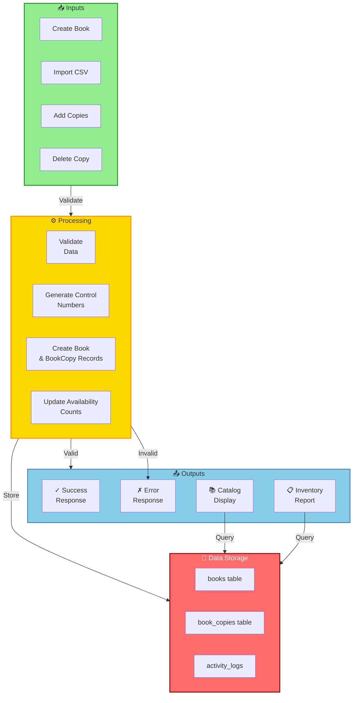
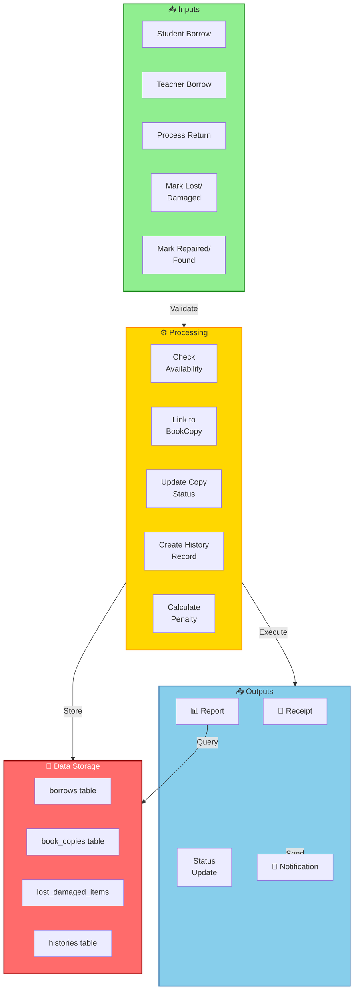
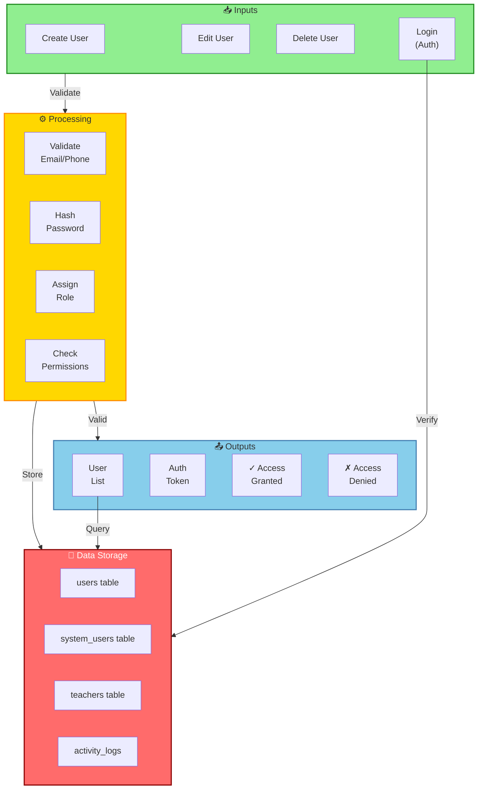
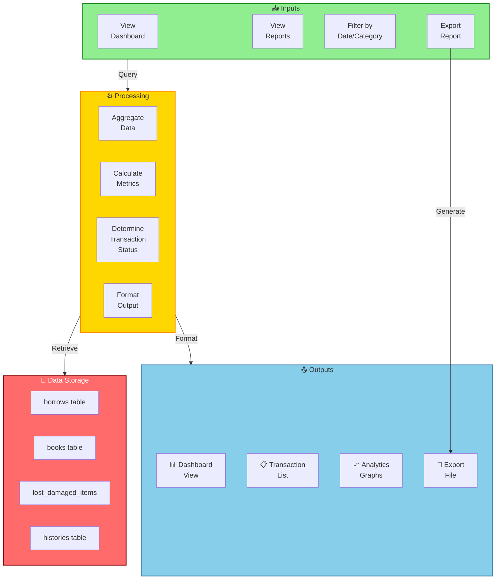

# Child Level Diagrams - Module Details

## 1. Books & Inventory Module Diagram

## 2. Borrowing & Returns Module Diagram

## 3. Users & Access Management Module Diagram

## 4. Reports & Analytics Module Diagram

---

## Summary of Child Modules

| Module | Primary Flow | Key Entities |
|--------|-------------|--------------|
| **Books & Inventory** | Input → Validate → Store → Display | Books, BookCopies, ControlNumbers |
| **Borrowing & Returns** | Input → Check Stock → Execute → Notify | Borrows, BookCopies, LostDamagedItems |
| **Users & Access** | Input → Validate → Authenticate → Authorize | Users, SystemUsers, Teachers, Roles |
| **Reports & Analytics** | Query → Aggregate → Calculate → Format | Transactions, Status History, Metrics |

Each module operates independently but shares common data and audit logging infrastructure.
