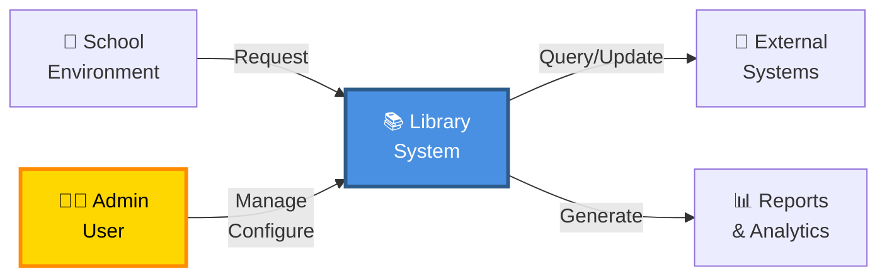
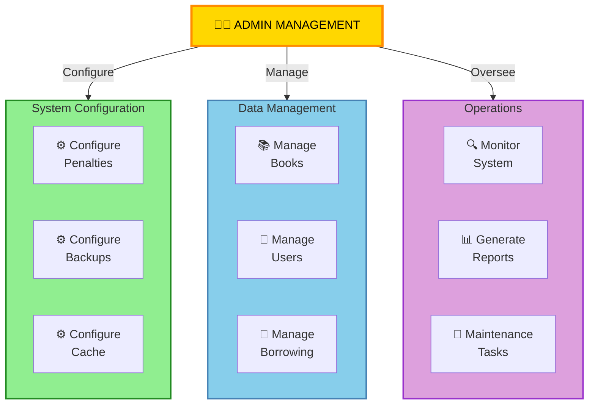
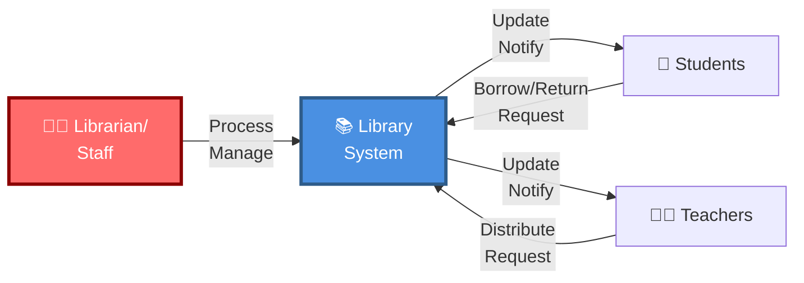
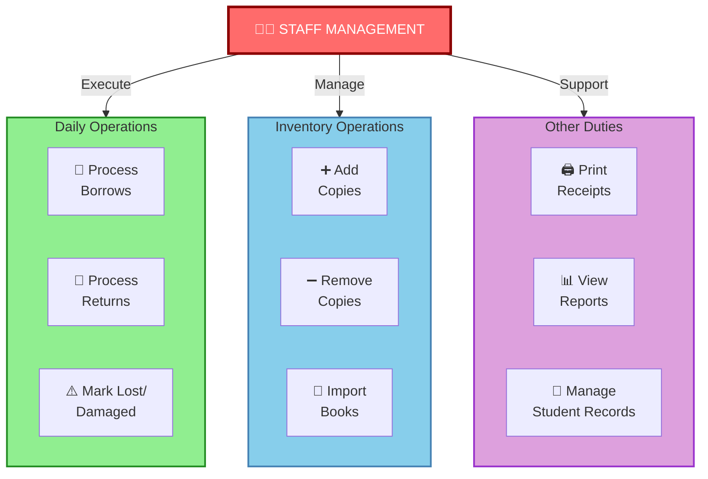

# HIPO Diagrams - Admin & Staff Management

HIPO (Hierarchical Input Process Output) diagrams provide a structured view of data flow and processing at different organizational levels.

---

## Admin Management HIPO Diagram

### Level 0: System Context



### Level 1: Admin Management Hierarchy



### Level 2: Admin HIPO - System Configuration

```
┌─────────────────────────────────────────────────────────────────┐
│ SYSTEM CONFIGURATION - LEVEL 2 HIPO                             │
├─────────────────────────────────────────────────────────────────┤
│                                                                  │
│  INPUT:                   │ PROCESS:                │ OUTPUT:   │
│  ┌──────────────────────┐ │ ┌────────────────────┐ │ ┌────────┐│
│  │ • Config Data        │ │ │ 1. Validate Input  │ │ │ Config ││
│  │ • Settings Files     │ │ │ 2. Parse Settings  │ │ │ Saved  ││
│  │ • Parameter Values   │ │ │ 3. Write to DB     │ │ │        ││
│  │ • System Env         │ │ │ 4. Update Cache    │ │ │ Confirm││
│  └──────────────────────┘ │ │ 5. Log Change      │ │ │ Message││
│                           │ └────────────────────┘ │ └────────┘│
│  STORAGE: config table, cache, activity_logs                    │
└─────────────────────────────────────────────────────────────────┘
```

### Level 2: Admin HIPO - Data Management

```
┌──────────────────────────────────────────────────────────────────┐
│ DATA MANAGEMENT - LEVEL 2 HIPO                                   │
├──────────────────────────────────────────────────────────────────┤
│                                                                   │
│  INPUT:                   │ PROCESS:               │ OUTPUT:     │
│  ┌───────────────────────┐ │ ┌───────────────────┐ │ ┌─────────┐│
│  │ • Book Data           │ │ │ Book Module:      │ │ │ Books   ││
│  │ • User Records        │ │ │ • Validate ISBN  │ │ │ Created ││
│  │ • Borrow Requests     │ │ │ • Gen Ctrl Nbr   │ │ │ Users   ││
│  │ • Return Data         │ │ │ • Create Records │ │ │ Added   ││
│  │ • Status Updates      │ │ │ • Update Counts  │ │ │ Status  ││
│  └───────────────────────┘ │ │                   │ │ │ Updated ││
│                            │ │ User Module:      │ │ │ Success/││
│  VALIDATION:               │ │ • Hash Password   │ │ │ Error   ││
│  • Duplicate Check         │ │ • Assign Role     │ │ └─────────┘│
│  • Data Type Check         │ │ • Set Permission  │ │            │
│  • Required Fields         │ │                   │ │ ACTIVITY   │
│                            │ │ Borrow Module:    │ │ LOGS:      │
│                            │ │ • Check Avail     │ │ • User     │
│                            │ │ • Link Copy       │ │ • Action   │
│                            │ │ • Track Status    │ │ • Target   │
│                            │ └───────────────────┘ │ • Details  │
│                                                    │            │
│ STORAGE: All core tables (books, users, borrows, book_copies)   │
└──────────────────────────────────────────────────────────────────┘
```

### Level 2: Admin HIPO - Operations & Reporting

```
┌──────────────────────────────────────────────────────────────────┐
│ OPERATIONS & REPORTING - LEVEL 2 HIPO                            │
├──────────────────────────────────────────────────────────────────┤
│                                                                   │
│  INPUT:                   │ PROCESS:               │ OUTPUT:     │
│  ┌───────────────────────┐ │ ┌───────────────────┐ │ ┌─────────┐│
│  │ • Date Range          │ │ │ 1. Query Data     │ │ │ Reports ││
│  │ • Filter Criteria     │ │ │ 2. Aggregate      │ │ │ (HTML/  ││
│  │ • Report Type         │ │ │ 3. Calculate      │ │ │ CSV/PDF)││
│  │ • Export Format       │ │ │    Metrics        │ │ │ Stats   ││
│  │ • User Actions        │ │ │ 4. Determine      │ │ │ Insights││
│  └───────────────────────┘ │ │    Status         │ │ │ Charts  ││
│                            │ │ 5. Format Output  │ │ │ Graphs  ││
│  QUERIES:                  │ │ 6. Log Report     │ │ │ Data    ││
│  • Total Books             │ │    Generation     │ │ │ Export  ││
│  • Available Copies        │ │                   │ │ └─────────┘│
│  • Active Borrows          │ │ MONITORING:       │ │            │
│  • Late Returns            │ │ • System Health   │ │ CACHE:     │
│  • Lost/Damaged            │ │ • Performance     │ │ Popular    │
│  • Penalties               │ │ • Error Logs      │ │ queries    │
│                            │ └───────────────────┘ │ for speed  │
│                                                    │            │
│ STORAGE: All transaction tables + cache layer     │            │
└──────────────────────────────────────────────────────────────────┘
```

---

## Staff Management HIPO Diagram

### Level 0: System Context



### Level 1: Staff Management Hierarchy



### Level 2: Staff HIPO - Daily Operations

```
┌──────────────────────────────────────────────────────────────────┐
│ DAILY OPERATIONS - LEVEL 2 HIPO                                  │
├──────────────────────────────────────────────────────────────────┤
│                                                                   │
│  INPUT:                   │ PROCESS:               │ OUTPUT:     │
│  ┌───────────────────────┐ │ ┌───────────────────┐ │ ┌─────────┐│
│  │ Borrow:               │ │ │ 1. Identify User  │ │ │ Borrow  ││
│  │ • Student/Teacher ID  │ │ │ 2. Select Book    │ │ │ Receipt ││
│  │ • Book Selection      │ │ │ 3. Check Avail    │ │ │ Confirmation││
│  │ • Quantity            │ │ │ 4. Create Record  │ │ │         ││
│  │                       │ │ │ 5. Update Counts  │ │ │ Return: ││
│  │ Return:               │ │ │ 6. Log Activity   │ │ │ Status  ││
│  │ • Borrow ID           │ │ │ 7. Send Notice    │ │ │ Update  ││
│  │ • Condition           │ │ │                   │ │ │ Record  ││
│  │ • Return Status       │ │ │ 8. Calc Penalty   │ │ │ Penalty ││
│  │ • Notes               │ │ │ (if applicable)   │ │ │ (if any)││
│  └───────────────────────┘ │ │                   │ │ │ Fine    ││
│                            │ │ Special Cases:    │ │ │ Amount  ││
│  VALIDATION:               │ │ • Lost Book       │ │ │         ││
│  • User Exists             │ │ • Damaged Book    │ │ │ Activity││
│  • Available Stock         │ │ • Late Return     │ │ │ Logged  ││
│  • Active Status           │ │                   │ │ │ Email   ││
│  • Borrow Limits           │ └───────────────────┘ │ │ Sent    ││
│                                                    │ └─────────┘│
│ STORAGE: borrows, book_copies, lost_damaged_items, activity_logs│
└──────────────────────────────────────────────────────────────────┘
```

### Level 2: Staff HIPO - Inventory Operations

```
┌──────────────────────────────────────────────────────────────────┐
│ INVENTORY OPERATIONS - LEVEL 2 HIPO                              │
├──────────────────────────────────────────────────────────────────┤
│                                                                   │
│  INPUT:                   │ PROCESS:               │ OUTPUT:     │
│  ┌───────────────────────┐ │ ┌───────────────────┐ │ ┌─────────┐│
│  │ Add Copies:           │ │ │ Add Copies:       │ │ │ Copies  ││
│  │ • Book ID             │ │ │ • Get Last Nbr    │ │ │ Added   ││
│  │ • Quantity            │ │ │ • Gen Ctrl Nums   │ │ │ Ctrl Nos││
│  │ • Condition           │ │ │ • Create Records  │ │ │ Assigned││
│  │                       │ │ │ • Update Book     │ │ │ Count   ││
│  │ Remove Copies:        │ │ │   Copies Count    │ │ │ Updated ││
│  │ • Control Number      │ │ │                   │ │ │ Confirm ││
│  │ • Reason              │ │ │ Remove Copies:    │ │ │ Message ││
│  │                       │ │ │ • Find Record     │ │ │         ││
│  │ Import Books:         │ │ │ • Archive Entry   │ │ │ Import: ││
│  │ • CSV File            │ │ │ • Update Counts   │ │ │ Books   ││
│  │ • File Format         │ │ │ • Log Action      │ │ │ Added   ││
│  │ • Validation Rules    │ │ │                   │ │ │ Warnings││
│  └───────────────────────┘ │ │ Import Books:     │ │ │ if any  ││
│                            │ │ • Parse CSV       │ │ │         ││
│  VALIDATION:               │ │ • Validate Data   │ │ │ Activity││
│  • Control Nbr Unique      │ │ • Check ISBN Dup  │ │ │ Logged  ││
│  • File Format Valid       │ │ • Create Records  │ │ │ Audit   ││
│  • Required Fields         │ │ • Gen Ctrl Nbrs   │ │ │ Trail   ││
│  • Duplicate Books         │ │ • Log Results     │ │ │ Created ││
│  • Data Type Correct       │ └───────────────────┘ │ └─────────┘│
│                                                    │            │
│ STORAGE: books, book_copies, activity_logs        │            │
└──────────────────────────────────────────────────────────────────┘
```

### Level 2: Staff HIPO - Support & Reporting

```
┌──────────────────────────────────────────────────────────────────┐
│ SUPPORT & REPORTING - LEVEL 2 HIPO                               │
├──────────────────────────────────────────────────────────────────┤
│                                                                   │
│  INPUT:                   │ PROCESS:               │ OUTPUT:     │
│  ┌───────────────────────┐ │ ┌───────────────────┐ │ ┌─────────┐│
│  │ Print Receipt:        │ │ │ 1. Get Borrow     │ │ │ Receipt ││
│  │ • Borrow ID           │ │ │    Record         │ │ │ (Printed)││
│  │                       │ │ │ 2. Format Data    │ │ │ Barcode ││
│  │ View Reports:         │ │ │ 3. Include Terms  │ │ │ Details ││
│  │ • Report Type         │ │ │                   │ │ │         ││
│  │ • Date Range          │ │ │ Reports:          │ │ │ Reports ││
│  │ • Filter Options      │ │ │ • Query DB        │ │ │ (PDF/   ││
│  │                       │ │ │ • Aggregate Data  │ │ │ CSV)    ││
│  │ Manage Students:      │ │ │ • Transform for   │ │ │ Statistics││
│  │ • Student ID          │ │ │   Display         │ │ │ Charts  ││
│  │ • Update Info         │ │ │ • Cache Results   │ │ │         ││
│  │ • View History        │ │ │                   │ │ │ Students││
│  │                       │ │ │ Students:         │ │ │ Records ││
│  └───────────────────────┘ │ │ • View Record     │ │ │ Updated ││
│                            │ │ • See Borrow Hist │ │ │ Borrow  ││
│  QUERIES:                  │ │ • Check Penalties │ │ │ History ││
│  • Borrow Info             │ │ • Update Details  │ │ │ Shown   ││
│  • User Details            │ │                   │ │ │ Email   ││
│  • Book Info               │ │                   │ │ │ Sent    ││
│  • Historical Data         │ └───────────────────┘ │ └─────────┘│
│                                                    │            │
│ STORAGE: All tables for queries; cache layer used │            │
└──────────────────────────────────────────────────────────────────┘
```

---

## Key Differences: Admin vs Staff

| Aspect | Admin | Staff |
|--------|-------|-------|
| **Scope** | System-wide configuration & oversight | Daily operations & transactions |
| **Data Access** | All data, ability to configure | Transaction data & inventory |
| **Primary Functions** | Monitor, Configure, Report | Process, Manage, Serve |
| **Frequency** | Periodic (daily/weekly) | Continuous (all day) |
| **Risk Level** | High (system-wide impact) | Medium (operational) |
| **Audit Importance** | Complete audit trail | Transaction logging |
